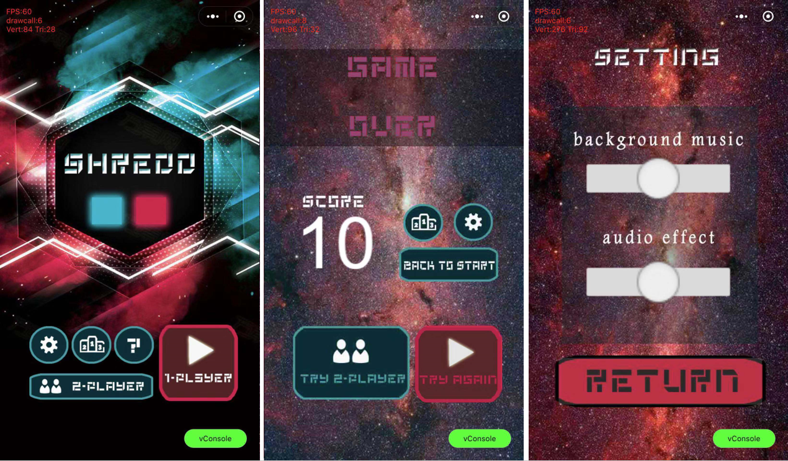
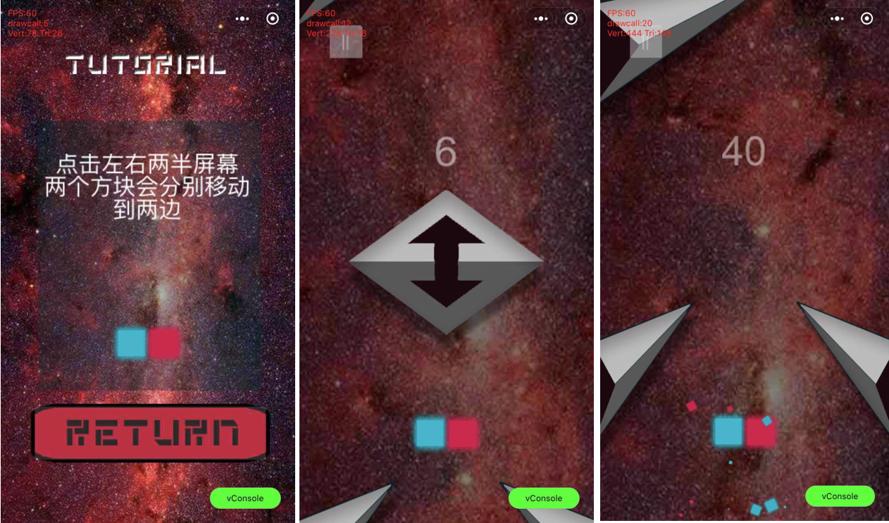

#综合实验 报告

**成员**

- 汪颖祺 2017011996 软件71
- 唐建宇 2017012221 软件71


## 一、说明

#### 二维码


#### 提交的文件结构

- Shredd 包含游戏主域的文件，包括源文件以及构筑好的文件
- server 包含服务端文件
- SubContext 包含微信开放数据域的相关文件
- Design 包含设计文件
- doc 包含文档
- ext 为其他文件

####开发环境

- 操作系统： Win10
- 引擎：Cocos creator 2.0.10
- 编程语言：前端使用 typescript；服务端使用 javascript
- 第三方库的使用： socket.io （详见第四、五节）

#### 代码风格

前后端分别使用了 js 和 ts。

采用 eslint 统一代码风格，配置文件在 ext 文件夹中。

##二、游戏策划

####1.选题

游戏灵感来源于一款名叫shredd的ios端手机游戏。我们采用了shredd游戏的核心玩法，但是设计素材，功能实现，障碍设置等等均由我们自主完成。

####2.核心玩法

操控两个位于屏幕中间并排的小方块躲避前方的障碍物：

- 触摸屏幕左（右）侧，两个小方块同时靠左（右）
- 同时触摸屏幕左右两侧，两个小方块各自向左右两边分开

障碍物会出现在左侧、中间、或右侧，需要通过上述操作进行躲避。

随着游戏进程，速度会越来越快，对玩家的反应速度和节奏感要求越来越高。

#### 3.游戏模式

设计了单人/匹配对战两种模式：

- 单人游戏中，将会记录玩家的得分并上传微信好友排行榜
- 双人游戏中，除了上传玩家分数，还匹配一名对手与玩家对战，在对战结束后显示双方的得分和胜负情况。

#### 4.数值设计

经过多次尝试修改，最终找到了一个较为合理的初始速度，并按照如下规则进行速度的逐渐提升：

```typescript
this.shiftSpeed = 1.1 * this.startSpeed / (this.startSpeed + this.level * 30);
return cc.v2(0, -340 - this.level * 40)  //速度
```


##三、界面布局和设计

所有页面均有背景音乐，游戏界面和教程界面还设有音效；背景均由ps制作成图。

####1.开始界面 

设有五个按钮，分别为教程按钮，设置按钮，排行榜按钮，双人模式按钮，和单人模式按钮。单人模式按钮设置闪动动画，增强游戏动感。

- 联网后：显示当前状态：连接或匹配或即将开始；有取消键取消匹配；
- 微信排行榜：每页显示七条记录，显示名次、头像、昵称、最高分数；第一名昵称以红色突出，第二三名以黄色突出。

####2.教程界面

上半部分写有教程提示内容，下半部分绘有游戏界面的两个方块。玩家根据提示进行操作。比如，提示点击屏幕右半部分，则会出现游戏方块均向右移；然后会出现下一个提示，依次进行操作，直至教学完成。

####3.设置界面

主要为两个滚动框，用来设置背景音乐和游戏音效（碰撞声和点击声）音量大小

####4.游戏界面

刚进入游戏界面，两个方块均会放出礼花效果，是使用粒子系统完成的。然后，会看到各种障碍物依次向下出现，玩家需要控制方块躲避障碍物。每过十个障碍物，会出现一条闪动颜色的彩带，方块经过彩带时，会出现礼花效果；同时，游戏等级上升一级，速度加快，游戏难度加大。游戏左上方上设有暂停按钮。游戏正上方显示当前游戏分数。

####5.结束界面

分为单人结束界面和联网双人结束界面。

- 单人结束界面包含上方闪动的game over字样，中间的分数核算，设置按钮，排行榜按钮，以及下方的尝试双人模式按钮和再试一次按钮。
- 双人模式结束界面首先会提示等待对手结束，对手结束后则显示双方分数与胜负结果。


##四、技术实现方案

#### 1.小方块的控制

整体思路是给小方块预先设置了几个移动动作，如向左、向右，然后根据需求将这些动作组合起来。为了处理左右两半不同的触摸响应，设计了两个大的按钮分别覆盖屏幕的左右两边，给按钮的触摸事件添加了响应，会向上发出信号。在根节点挂载的控制组件监听按钮发出的信号，根据左边触摸、右边触摸、同时触摸等情况分别调用相应的移动小方块的函数进行处理。同时考虑到了多次触摸同一边，触摸某一边时同时开始触摸另一侧等情况，利用表征当前触摸状态的变量进行判断，再做相应处理。

####2.控制障碍物生成

一开始先尝试了直接用ps作图，把障碍物都画在图上，然后对障碍物设置碰撞体，对长图进行滚动即可，但考虑这样的方案实在是很不工程化，遂作罢，更换为下一个方案。下一个方案通过对四种障碍物（左障碍物，右障碍物，居中障碍物和空心障碍物）存储为预制资源，定时生成节点来控制。在界面中设置一个空节点名为obstaclePool，生成的所有障碍物节点均以此为父节点，方便统一管理。四种障碍物均设置为碰撞体，并设置线性速度，控制其匀速向下运动。

####3.背景滚动

虽然对于玩家可能并不是很容易注意到，但是本游戏场景的背景图其实是一直在滚动的。这个效果起初想通过引擎的动画组件来实现，但是效果并不理想。原因在于，引擎的动画组件虽然可以设置循环播放，但是一头一尾的衔接一定会出现接缝的“黑屏”。就是说，肉眼可见的画面突然一顿，变为了另一个画面继续滚动。这是由于光靠引擎，动画很难精准控制接缝的位置。后来，本场景的实现是通过利用两张对称的图，一起滚动实现：当上面一张图滚出视线，就将其移到最下方，再两张一起滚动。此时，肉眼看不出滚动的“接缝”，而是感觉画面一直在往下。

####4.障碍物生成距离不变

本游戏中，障碍物的距离由两个因素控制：一个是障碍物生成的速度间隔；一个是障碍物匀速下落的速度。通过小小的数学计算，可以发现，保证间隔不变均为（起始间隔/s起始下落速度m/s），只需在每次等级升高时，改变生成速度间隔为（起始间隔/s起始下落速度m/s）/ 当前下落速度。

####5.暂停实现

点击暂停按钮，控制背景不移动，控制屏幕点击失效，控制物体下落速度为零，控制游戏界面不再新生成障碍物。再次点击，则恢复上述所有运动。

####6.音量控制

将背景音乐和音效大小均设置为全局变量。每次进入界面，自动读取全局变量中的数据，设置当前页面音量即可。

####7.微信排行榜的实现

学习了微信开放数据域的相关接口，在开放域中渲染排行榜同时编写了提交分数、获取排名等接口，在主域中通过postMessage调用这些接口，完成上传分数，显示排行榜等操作。但是当排行榜过长时的翻页就存在问题，不能直接在子域中使用现成的UI，因为在主域中无法直接控制这些UI，因此就直接在主域中实现了翻页的按钮，再调用子域提供的翻页接口完成交互。

#### 8.分包的实现

为了避免因为数据的依赖导致分包后无法加载的问题，我们在游戏开始时首先设置了一个loading界面，完成分包（后续界面的所有图片资源）的加载，而这一loading界面的代码、图片等素材都是独立存放的，因此不会有任何依赖，只有loading结束后，才加载start界面进入游戏。


##五、重点与难点

####1.界面适配

我们选择了微信小游戏文档中所说的最合适的适配大小750*1334。所有的背景图均按上述比例制作。然后，在代码中利用cc.Winsize得到当前屏幕大小，再对背景以及界面中各节点内容进行适配。作业过程中，也发现了不少cocos creator的巨坑。比如，设置动画时，一定要关掉锁定动画，再看模拟器显示，不然一定是大小不准的。障碍物的位置需要不断在真机上进行测试，因为不同手机型号对于位置的偏移不同，导致方块无法躲过障碍。

####2.游戏效果

1. 方块的礼花效果：利用粒子系统实现，改变例子发射方向，发射速度，重力大小等参数来实现。并设置为预制资源，这样就方便调用（比如遇到彩带时，出现礼花效果）。
2. 撞击时的晃动效果：游戏在发生撞击时，并没有直接调用结束界面，而是会看到一个短暂的全屏晃动效果。实现方法为单独写了一个shake的ts文件，并设置对外接口。在主游戏界面中，一旦出现撞击，便先触发暂停游戏函数，然后调用shake晃屏，最后载入结束界面。
3. 按钮的闪动和彩带的闪动： 均采用动画实现。在原图案上赋上另一颜色图案，然后插入透明度变化动画即可。增加游戏动感效果。

#### 3.联网对战

1. 整体思路：

   设计了queue和room两步的连接程序：

   - 玩家点击双人游戏后，首先连接queue的socket，服务端接到连接后，寻找空的room，并将room的地址发送给客户端；
   - 收到地址后，客户端断开与queue的连接，用上述地址连接进入room的socket，连接成功后给玩家分配编号，当一间room有了两个玩家后，则自动开始游戏；
   - 游戏结束后，向room反馈分数，并在游戏结束界面显示等待对手，如果双方都反馈了分数，room向双方广播比赛结果，客户端收到结果后，更新结束界面的分数、游戏结果信息，并断开连接。

2. 关于 socket.io

   为了实现联网，使用了 socket.io 这一封装了 websocket 的第三方库。主要利用了其封装的事件监听和发送机制，将进入房间、广播分数等事件以事件名+json信息的形式进行封装，相比websocket原生的arraybuffer或字符串简化了处理。但是，在开发中，这也造成了一个困扰了我一整天的bug，当项目基本完成，准备在手机上调试时，发现了一个看不懂的报错，网上也没有相关信息，但是微信开发者工具在电脑上模拟完全没有问题，最终只能通过将github上的所有commit用二分查找的方式下载下来真机调试，终于找到了第一次无法进行真机调试的版本，也即完成联网功能的版本，经过搜索，发现是因为微信小游戏不支持原生的socket.io，最终换成了大佬修改过的支持微信的weappsocket.io。这也给我留下了教训，应该第一时间上机调试，不能过于相信开发者工具的模拟。

3. 关于超时

   微信小游戏对于游戏的socket连接超时的最大时限是60s，这也造成了提前请学长试玩时发现的经常性无法显示对手得分这一bug，后来终于发现是一定时间内没有信号的交互造成的自动断开连接，最终通过在服务端通过setInterval定时（每30s）发送保持连接的无实质意义的信号确保连接始终不中断。


##六、优化

游戏主要的问题就是在一开始进入游戏过程中，会有轻微的卡顿。我们做了如下努力去优化。

1. update和schedule的优化，将主要的计算放入schedule中，按预定的事件间隔执行，避免了update中每帧都进行判断和计算。
2. 图片资源设计过程中都极尽精简，压缩为最小容量，保证最快载入。对音乐的选取同理。
3. 子数据域的尽量（除特殊情况）在主域不显示排行榜时保持不渲染的状态。
4. 代码优化： 保证每帧的运算量不会过大。减小设置active和false，instantiate和destroy等耗时操作的产生。对循环语句也进行了优化，改for语句为node.forEach(element=>{})，因为经过测试两者所耗时间有很大区别。


##七、亮点

**游戏图片素材原创设计**






**双人模式的完成**

可以在线匹配对手。


## 八、测试情况

修复了学长们试玩时发现的bug。

我们自己的测试情况如下：

| 唐建宇 | 小米6         |
| ------ | ------------- |
| 汪颖祺 | iPhone 8 plus |
| G同学  | 小米8         |
| C同学  | 华为P30       |
| L同学  | 小米 max2     |
| L2同学 | iphone 7      |

在以上同学测试中，均能以60的帧率流畅运行。


## 九、分工情况

| 汪颖祺                                                       | 唐建宇                                                       |
| ------------------------------------------------------------ | ------------------------------------------------------------ |
| 游戏界面：背景滚动、障碍物生成、碰撞检测等除小方块控制外的核心玩法的部分；设置界面；教程界面；音效的加入；所有图片的设计制作工作；粒子特效和动画的实现；后期对游戏界面卡顿的优化。 | 小方块的控制逻辑；联网对战功能的前后端实现；排行榜功能中子域和主域相关接口、界面的实现；结束界面和联网结束界面的交互实现和屏幕适配；后期主要的测试和debug以及游戏相关数值的调整。 |

